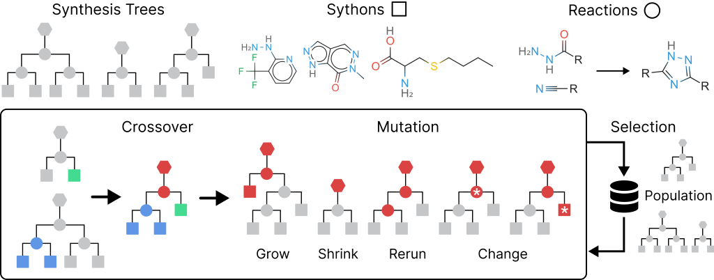

<div align="center">   

# A Genetic Algorithm for Navigating <br> Synthesizable Molecular Spaces

<br>



</div>

<br>

This repository contains the SynGA algorithm and code to reproduce the paper: A Genetic Algorithm for Navigating
Synthesizable Molecular Spaces (ICLR 2026).

- Paper: https://openreview.net/forum?id=OvMtGGaFUT
- ArXiv: https://arxiv.org/abs/2509.20719

---

## Installation

To install requirements:

```bash
conda env create -f environment.yml 
```

We include our precise conda environment in `environment_full.yml` too. After activating your conda environment,
install UniDock tools (v1.1.2) with:

```bash
pip install git+https://github.com/dptech-corp/Uni-Dock.git@1.1.2#subdirectory=unidock_tools
```

## Data

To reproduce our main results, you need:

1. A building block set. In our work, we start with ChemProjector's block set which was obtained from the Enamine Building
   Blocks catalog. Follow their
   download [instructions](https://github.com/luost26/ChemProjector/tree/main?tab=readme-ov-file#building-block-data)
   and extract the blocks from their `matrix.pkl` file into a text file of SMILES strings.
2. A reaction set (`data/libs/hb.txt` is used by default).

First, initialize a `chemspace` synthesis library by processing the downloaded blocks and reactions:

```bash
python -m data.libs.setup --name=chemspace --blocks=[BLOCK_PATH] --num_workers=16
```

This creates a new directory `data/libs/chemspace` with the processed blocks and some caches. The name `chemspace` is
used as a default argument in subsequent commands.

## Usage

### Analog Search

For analog search, we include the datasets used in our experiments under `data/test`:

```
chembl.txt:         Random 1k ChEMBL molecules
chembl_small.txt:   Random 100 ChEMBL molecules 
designs.csv:        Filtered structure-based and goal-directed designs for LIT-PCBA and GuacaMol
```

Download the [checkpoint](https://huggingface.co/datasets/alstonlo/synga-data) and run analog search:

```
python -m src.analog \
   --dataset=[DATASET_PATH] \
   --seed=0 --num_workers=100 \
   --logger.project=[WANDB_PROJECT] --log_analogs=10 \
   --optimizer=SynthesisGA --optimizer.founder_size=5000 --budget=10000 \
   --objective='{"count": True, "murcko": False}' \
   --bbfilter.checkpoint=[CHECKPOINT_PATH]
```

The `"count"` field in the `objective` argument toggles whether to use count or bit fingerprints when computing the
fitness function, and the `"murcko"` field controls whether to use 0.9Morgan + 0.1Murcko as the fitness function (as
opposed to just Morgan). The 10 best analogs will be uploaded to WandB.

### Practical Molecular Optimization

**SynGA.** Run SynGA on a task from PMO:

```
python -m src.optimize \
   --seed=0 --trials=5 --num_workers=5 \
   --optimizer=SynthesisGA \
   --logger.project=[WANDB_PROJECT] \
   --objective=[TASK] 
```

Under the hood, this runs 5 trials sequentially by incrementing the seed each time. In practice, one can run the same
command 5 times with `trials=1` and different seeds.

**SynGBO.** Run SynGBO on a task from PMO:

```
python -m src.optimize \
   --seed=0 --trials=5 --num_workers=0 \
   --optimizer=SynthesisGBO \
   --optimizer.device=cuda --optimizer.synga_num_workers=20 \
   --logger.project=[WANDB_PROJECT] \
   --objective=[TASK]
```

Here, `num_workers` are the workers used to parallelize oracle calls, whereas `synga_num_workers` are the workers
used to parallelize the SynGA inner loop.

### LIT-PCBA Docking

Download the LIT-PCBA dataset from [RxnFlow](https://github.com/SeonghwanSeo/RxnFlow/blob/master/data/README.md) into
the `data/LIT-PCBA` folder. As a preprocessing stop, we need to convert the receptor PDB files into PDBQT files by
running the script at `scripts/litpcba/0_setup.py`.

**SynGA.** Run SynGA on a receptor for 1 trial:

```
python -m src.optimize_dock \
   --seed=0 --num_workers=50 --budget=16000 \
   --optimizer=SynthesisGA --optimizer.maxatoms=50 \
   --optimizer.founder_size=1000 --optimizer.population_size=5000 --optimizer.offspring_size=100 \
   --logger.project=[WANDB_PROJECT] --log_every_n_calls=200 \
   --receptor=[RECEPTOR]
```

**SynGBO.** Run SynGBO on a receptor for 1 trial:

```
python -m src.optimize_dock \
   --seed=0 --num_workers=20 --budget=16000 \
   --optimizer=SynthesisGBO --optimizer.maxatoms=50 \
   --optimizer.device=cuda --optimizer.synga_num_workers=20 \
   --optimizer.initial_size=20 --optimizer.propose_size=20 \
   --logger.project=[WANDB_PROJECT] --log_every_n_calls=200 \
   --receptor=[RECEPTOR]
```

## Scripts

The `scripts` directory contains one-off scripts for data processing, metric collection, and visualization. It is
organized into the following subfolders

```
bbfilter          Training the MLP block filter
project_designs   Projecting molecules from generative models
nam               Ablating the NAM 
pmo               PMO benchmark 
litpcba           LIT-PCBA docking benchmark
```

